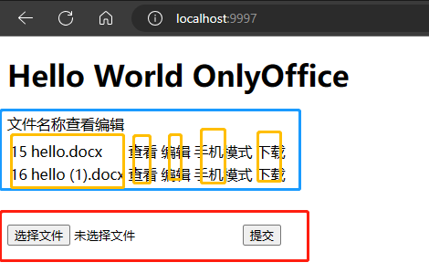

# onlyoffice

## 介绍
一个基于only office在线编辑word、excel、ppt的项目

## 安装教程
### 安装only office
```
  //使用开发版，里面内置了rabbitmq、redis、nginx等必要的服务
    
    docker pull onlyoffice/documentserver-de
    
    docker run -i -t -d -p 8050:80 onlyoffice/documentserver-de
 ```
### 安装mysql  
```
docker pull mysql:5.6

docker run -d -p 3306:3306 -e MYSQL_ROOT_PASSWORD=root mysql:5.6


CREATE TABLE `only_office_file` (
  `id` bigint(20) NOT NULL AUTO_INCREMENT COMMENT '文件id',
  `file_key` char(10) DEFAULT NULL COMMENT '文件唯一标识',
  `title` varchar(255) NOT NULL COMMENT '文件名称',
  `name` varchar(255) NOT NULL COMMENT '文件名称',
  `suffix` varchar(10) NOT NULL COMMENT '文件后缀',
  `content_type` varchar(255) DEFAULT NULL COMMENT '文件content-type',
  `length` bigint(11) NOT NULL COMMENT '文件大小',
  `url` text NOT NULL COMMENT '文件真实地址',
  `create_time` datetime NOT NULL ON UPDATE CURRENT_TIMESTAMP COMMENT '创建时间',
  `creater` varchar(255) DEFAULT NULL COMMENT '创建人',
  `update_time` datetime DEFAULT NULL ON UPDATE CURRENT_TIMESTAMP COMMENT '跟新时间',
  `updater` varchar(255) DEFAULT NULL COMMENT '跟新人',
  `status` tinyint(4) DEFAULT '1' COMMENT '状态',
  `version` int(11) NOT NULL DEFAULT '1' COMMENT '版本',
  `md5` char(32) DEFAULT NULL COMMENT 'md5值',
  `expiry` bigint(20) DEFAULT NULL COMMENT '过期时间',
  PRIMARY KEY (`id`)
) ENGINE=InnoDB AUTO_INCREMENT=14 DEFAULT CHARSET=utf8mb4;
```
### 安装minio
```
    docker pull minio
```

#### 配置说明
```yaml
spring:
    datasource:
        url: xxx
        username: xxx
        password: xxx

# 文件存储服务器
minio:
    endpoint: xx
    bucket: xx
    endpoint: xx
    secrekey: xx

#  当onlyoffice开启了secret时使用，需要跟服务器中的一样
token:
    secret： xx
    expore: xx

office:
    ip: xxx  # 项目启动ip + pord  localhost:9997
    api: xxxx # docker容器onlyoffice的js文件地址（很重要）
    # 其他没啥需要改的，logo啥的都是对页面展示的东西修改可以去查看官方文档
```

## 首页
```
1. 选择文件上传，点击提交
2. 列表显示记录，查看、编辑、手机模式、下载 
```
